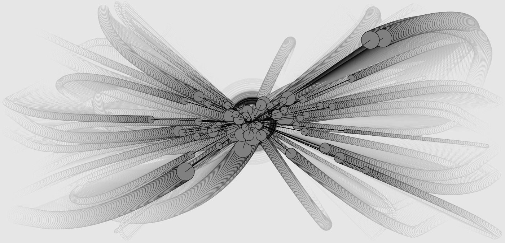
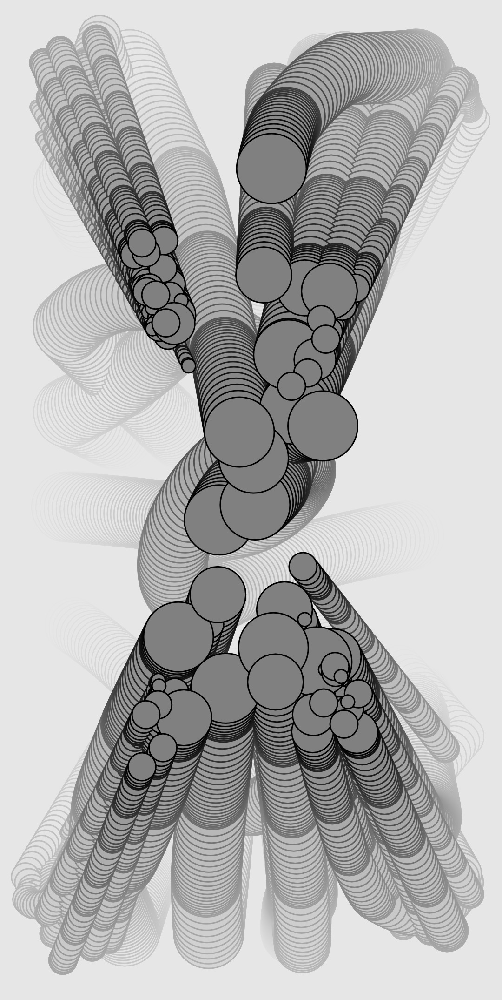
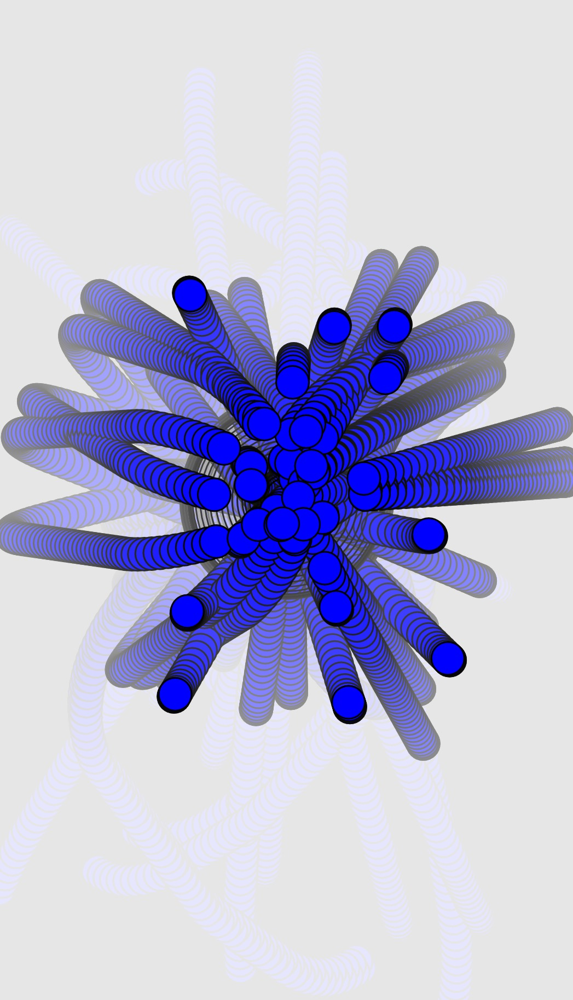

<div>
<h1>Audio Visualizer</h1>
</div>


## Stream Two Project: Interactive Frontend Development - Code Institute

This project is an interactive live audio visualizer. It is based on a sketch I had previously written in Processing, [mover_audio](https://github.com/tesoph/mover_audio). This sketch's inspiration was the book The Nature of Code by Daniel Shiffman. For this project I rewrote the sketch in Javascript using the library p5.js and added several features to make it interactive. It requires audio input from the microphone to run. How the audio visualizer looks can be controlled by the user via the settings menu. There is also the ability to save an image of the current frame as a .jpg image, and to open the audio visualizer in fullscreen mode.


## Table of contents
* [Demo](#Demo)
* [Gallery](#Gallery)
* [Features](#Features)
* [Technologies Used](#technologies-used)
* [Testing](#testing)
* [Deployment](#deployment)
  * How this project was deployed to GitHub Pages
  * How to run this project locally
* [Credits](#credits)


## Demo
A live demo can be found [here](https://tesoph.github.io/audio/).


## Gallery
<p align="center">
  
  
  
  
</p>


## Features
### Existing Features
* A settings menu to control the variables of the audio visualiser
* Save the current frame as a .jpg file
* Fullscreen mode
* More information modal


## Technologies Used
* Visual Studio Code
* HTML
* CSS
* Javascript
* [p5.js](https://p5js.org/)
  * Javascript library that is an interpretation of Processing.
* [p5.sound.js](https://p5js.org/reference/#/libraries/p5.sound)
  * Builds on the [Web Audio API](https://developer.mozilla.org/en-US/docs/Web/API/Web_Audio_API)
* [p5.dom.js](https://p5js.org/reference/#/libraries/p5.dom)
* jQuery
  * For DOM manipulation
* Bootstrap (v4.3.1)
  * For responsive styling and modal component
* [Range Touch](https://rangetouch.com/)
  * To improve sliders on touch devices
* Popper.js
	* For the more information popovers in the settings menu
* [Spectrum Colorpicker](https://briangrinstead.com/blog/input-type-color-polyfill/)
  * Polyfill for color input
* [Google fonts](https://fonts.google.com/)
* [Material Icon font](https://material.io/resources/icons/?style=baseline)
* [Autoprefixer](https://autoprefixer.github.io/
* [jShint](https://jshint.com/)

### p5.sound Classes Used
* p5.AudioIn - microphone
* p5.Amplitude - Analyze volume (amplitude)
* p5.FFT - Analyze amplitude over time / frequency.

## Deployment 
This project was developed using the code editor Visual Studio Code, committed to git and pushed to GitHub using the terminal. 

This site is hosted using GitHub pages, deployed directly from the master branch. The deployed site will update automatically upon new commits to the master branch. In order for the site to deploy correctly on GitHub pages, the landing page must be named `index.html`.

### How this project was deployed to GitHub Pages
1. Log into GitHub
2. Select the repository
3. Select the repository settings
4. Navigate to the GitHub Pages secction
5. Set Source to the Master Branch. This automatically refreshes the page and deploys the website.

### How to run this project locally:
1. Install Git following [these instructions](https://git-scm.com/book/en/v2/Getting-Started-Installing-Git)
2. Go to the [repository](https://github.com/tesoph/audio)
3. Click "clone or download"
4. Copy the clone URL 
5. Open command line interface
6. Create a directory
```console
mkdir repo
```
7. Change the current working directory to the directory from the previous step
```console
cd repo
```
8. Clone the repository to this directory 
```console
git clone https://github.com/USERNAME/REPOSITORY
```
9. Press enter
10. To cut ties with this GitHub repository, navigate to the directory it is in and type `git remote rm origin` into the command line.


## Testing
Testing information can be found in separate [testing.md](testing.md) file

## Credits
### Acknowledgements
* The code for the attractor and mover classes in main.js is adapted from chapter 2 of the book ["The Nature of Code" by Daniel Shiffman](https://natureofcode.com/book/chapter-2-forces/)

* Thanks to my mentor Brian Macharia for support and advice.